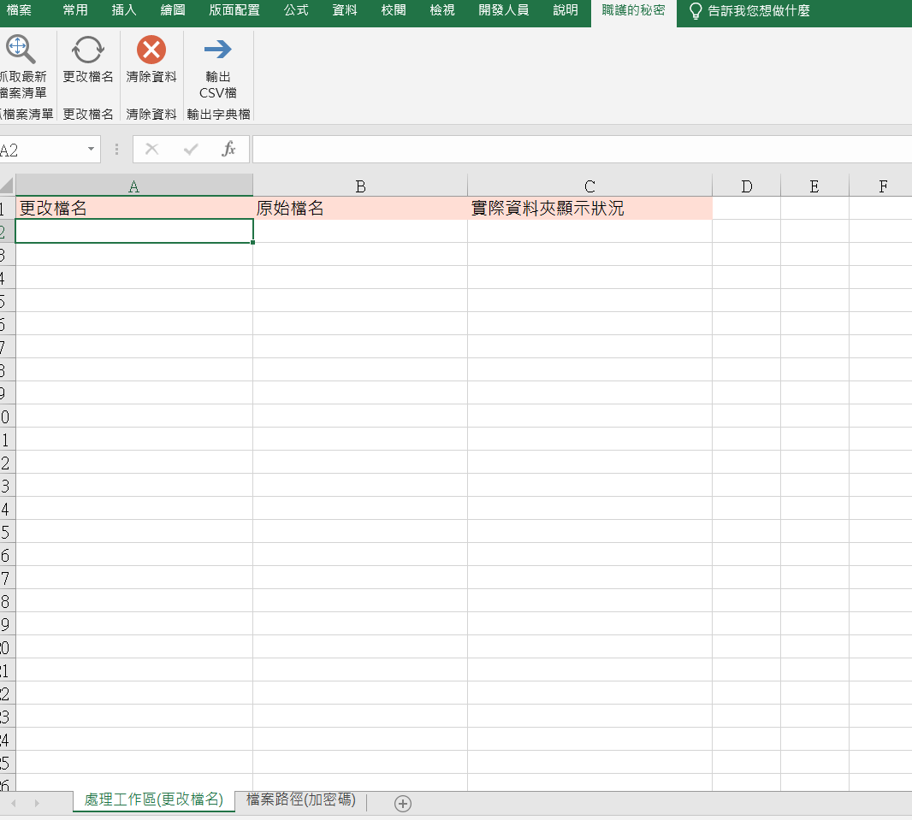
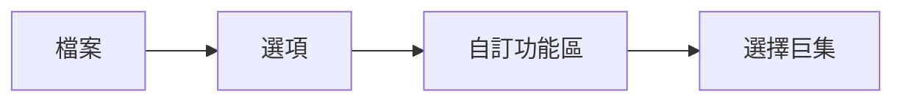

# 批次加密pdf 及 批次改檔名

-之前練習用, movement from:  
```
Script created by Imnoss Limited

please visit https://imnoss.com/batch-protect-pdfs-with-different-passwords/ for more information

Many thanks to empira Software GmbH (http://www.pdfsharp.net) who created the PdfSharp library and published it as Open Source software
```

* 因為是國外文件, 有編碼問題, 需要轉換`big5 to UTF8`, 才能處理csv檔案

* 他範例的csv檔案比較簡單, 我改成用excel 處理, 並添加批次改檔名的功能

## xlsm 如下所示



>NOTE:  VBA程式碼存成標準庫  <span style="color: brown">Module1.bas</span> 在同一個資料夾內

> NOTE: 打開excel匯入code後, 需要自訂工具列來執行這個巨集



會有四個自定義的巨集, 加入到功能區中(名字和icon選自己喜歡的) 即可

