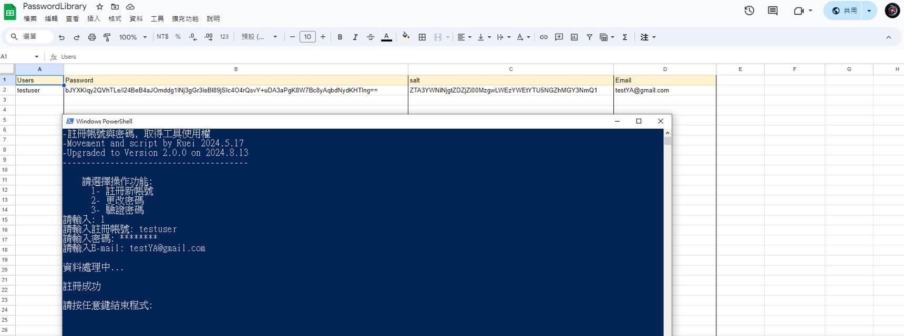

[[toc]]

# 帳號註冊

想做一個註冊帳號的小工具, 讓所有我的小玩具程式都要先登入帳密才能做有限度的使用.

我選擇用windows內建的powershell和google apps script當作資料庫

問題來了!

如果我單純... 
```powershell
$passWord = Read-Host "請輸入密碼"
```
那 `$passWord` 存的密碼不就被後端看光了?

    所以, 以下是密碼加料之旅(不一定正確或適合, 只是我自己的研究)

### 1

powershell 有提供前端隱藏輸入, 所以加上 `-AsSecureString` 的參數
後面總要解開密碼才能做操作, 但又不能明文出現, 也要避免被反序列, 
我弄一個`function()`, 直接明訂只能輸入密文資料做處理解密
```powershell
param(
  [parameter(Mandatory=$true)]
  [System.Security.SecureString]$SecurePassword
)
```
### 2

收到密文後, 利用`$Marshal = [System.Runtime.InteropServices.Marshal]`去拆密文
```powershell
$BSTR = $Marshal::SecureStringToBSTR($SecurePassword)
$passwordBytes = [System.Text.Encoding]::UTF8.GetBytes($Marshal::PtrToStringAuto($BSTR))
```

這樣`$BSTR`有存可以辨識的密碼, 要趕快清除避免被駭客
```powershell
$Marshal::ZeroFreeBSTR($BSTR)
```

### 3

雖然<span style = "color: navy;">__雜湊不是加密__</span>, 但電腦我目前不知道有甚麼可以使用的加密的工具,後來選擇用SHA512做雜湊, 並加鹽增加安全性, 減少彩虹攻擊.

做鹽巴:
```powershell
$salt = [System.Text.Encoding]::UTF8.GetBytes([System.Guid]::NewGuid().Tostring())
```
把原始密碼+鹽, 一起丟到SHA512做雜湊
```powershell
 $saltedPasswordBytes = $passwordBytes + $salt
 $SHA512 = [System.Security.Cryptography.SHA512Managed]::new()
 $Hash = $SHA512.ComputeHash($saltedPasswordBytes)
```
### 4

因為我是用apps sciript編寫接收資料, 資料是存在spreadsheet上, 用base64編碼做文本紀錄, 單純只是覺得呈現的strings看起來比較帥(其實是想學SQLite, 但目前apps scirpt比較熟悉)
```powershell
$HashBase64 = [Convert]::ToBase64String($Hash)
```
打包送出
```powershell
$body = @{
    type = $type
    username = $username
    password = $HashResult.HashBase64o
    salt = $HashResult.SaltBase64o
    useremail = $email
  } | ConvertTo-Json
```
powershell 可以用Invoke-RestMethod 傳送, 轉成JSON格式比較好解析(我也只會這個)

### 5

資料從本機電腦傳到網路的apps script接收, 這個其實幾乎90%像Javascript, 但有些東西不知道為什麼, apps scirpt不會提示也不會跳出建議字串, 但就是可以使用(對於菜鳥的我很痛苦, 我沒辦法判斷有沒有寫錯,只能問chatGPT)

像接收JSON資料就是一個例子: 
<div style= "position: relative; border: 1px solid #ddd; padding: 2px 5px; font-size: 12px; color: gray;">
  <span style="position: absolute; top: -10px; left: 10px; background-color; white; padding: 2px 5px; font-size: 12px; color: gray;">JavaScript</span>
    <pre>
      <code>
      function doPost(e){
        const data = JSON.parse(e.postData.contents);
      }
      </code>
    </pre>
</div>

以上這個就是無法顯示的例子, 但可以使用不會出現錯誤(我不知道是不是因為apps scirpt可以用其他方法)

### 6
這樣就可以解析出資料, 分為:<br>
data.type<br>
data.username  
data.password<br>
data.salt<br>
data.useremail

type 是用來切換功能用的, 中間用過很多方法, 後來喜歡用`switch`
```powershell
switch(data.type) {
 case '1'
 case '2'
 case '3'
}
```

多存一個鹽值, 是為了之後可以做驗證(當初加的鹽好像應該也要存起來)

    結論: 如下圖所示, 當你輸入帳號密碼註冊後, 後面的資料庫變這樣...



所以用戶輸入的密碼可以比較安全的保存...

