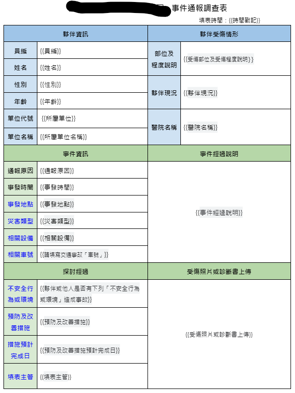

# 收到通報自動變成制定格式寄出及資料備存

Work flow as below:

* 收到員工回傳的表單填寫內容
* 抓取google 表單回存的spreadsheet資料, 調整成自己容易寫程式的順序
* 將資料依照設定套入公版內容, 公版格式如下:
  
  

* 寄信給監管者(?), 信件內容除了公版內容外(轉成圖片顯示), 還會有clients上傳的照片展開, 及附件pdf檔案
