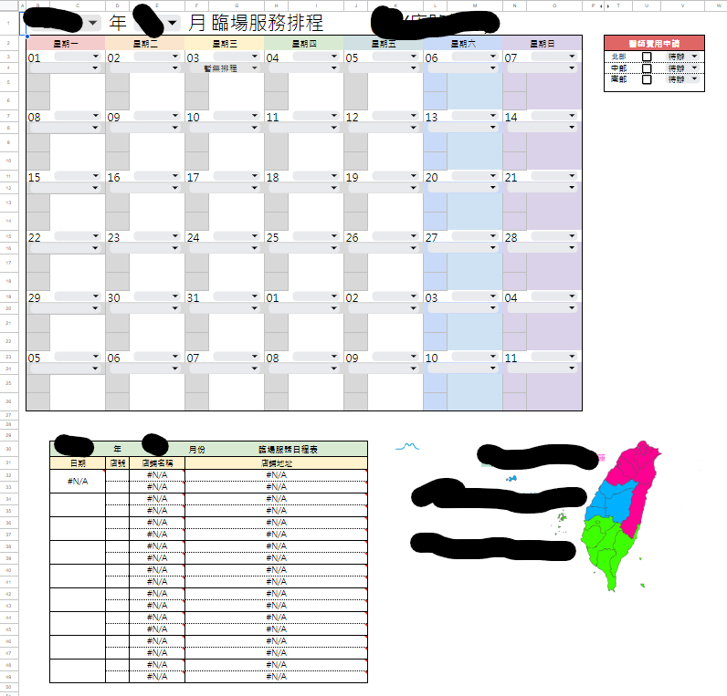
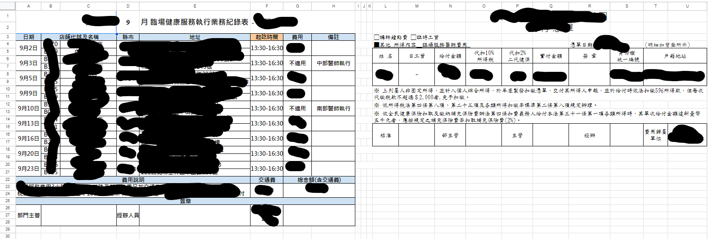
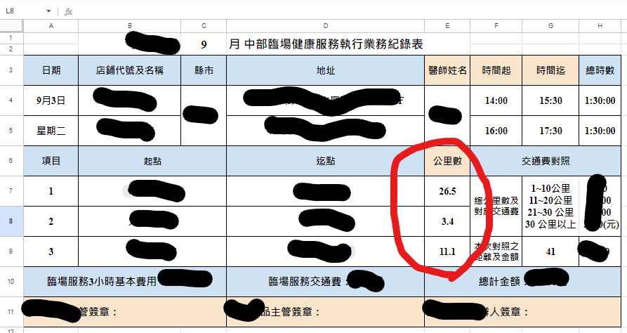

# 臨場服務表單自動化功能

依照現有的表單, 在後端程式做可自動化的流程方案

## 排班表介面設計

  使用的函數:
  * filter 避免一直重複填寫資料
  * date, weekday 製作可依照實際月份天數調整的月曆
  * 有名的陣列組合篩選函數:

    =ArrayFormula(IFERROR(INDEX($B$2:$B$999, SMALL(IF($U$3=$T$2:$T$999, ROW($T$2:$T$999)-ROW($T$2)+1), ROW(1:1))),"" ))
    >詳細說明自行上網查閱
  * 其餘為基本的if, 文字篩選如mid, len, right等, 避免重複一直輸入類似的東西, 都用公式帶入
  * 有用到xlookup

  相關表單範例如下:

  

## 自動化將行程輸入google日曆

利用現有表單, 客製化抓取需要內容, 自動輸入在google日曆中, 範例表單如下:

## 自動計算里程數

依照google最佳路程(汽車), 抓取現行表單內容, 自動計算相關訊息, 範例如下:

