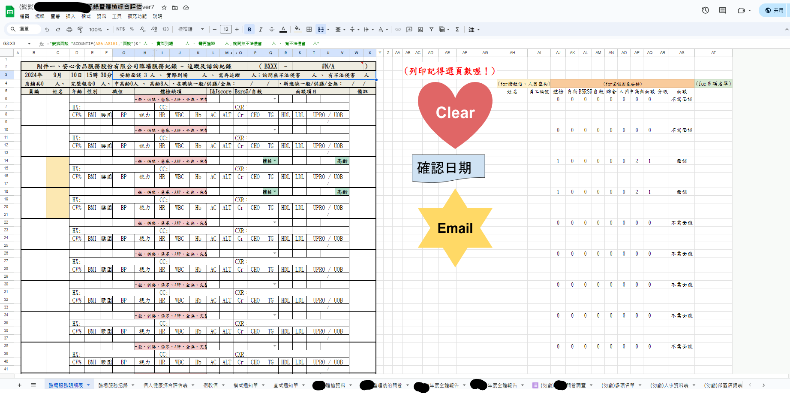
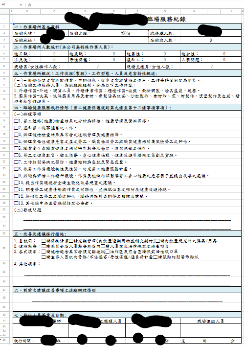
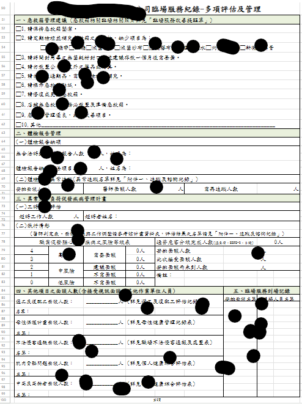
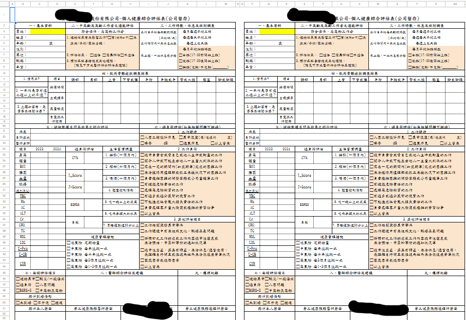
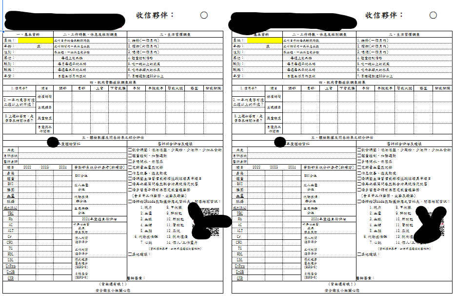
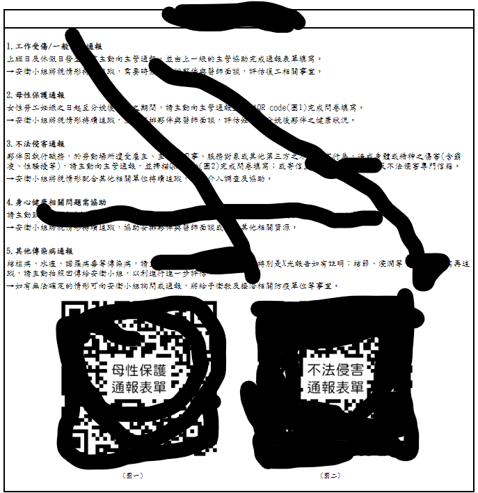
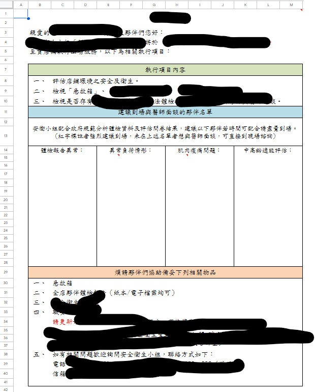

# 臨場服務紀錄暨體檢綜合評估表

* 表格模仿醫院的交班單, 方便看所有data
* 前端表單有的用函數設計, 有的用後端程式處理
* 基本上表格都全部自動帶入(只要把交班單體檢數值人工確認就好)
* 特別做一個 `trim.gs` 調整程式抓數據會在資料後面跑出一堆空白的問題 

 ## 表單範例
    類似醫院交班單的首頁

    附表八設計(根據職安四法範例文件)

    附表八第二頁

    給公司留存用的

    給員工的衛教信(正面&反面)

    寄信版面自動設定

