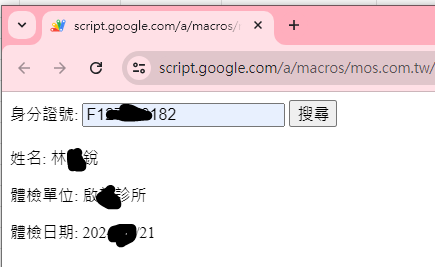
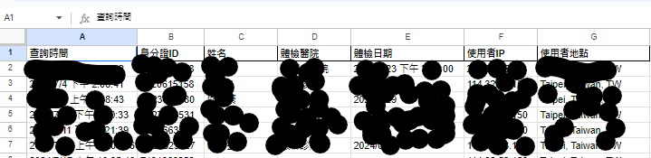

# 部屬網頁搜尋介面給外部搜尋, 取得指定內部資料

* 通常職護需要保管員工體檢資料, 屬於個資. 如果有外包廠商需要取得例如"此位員工有無體檢" 及 "在哪間醫院體檢" 等限定資訊, 是可以提供. 
* 傳統會透過email寄送請求, 我方再依據資料庫, 回信給外部廠商, 這部分可透過自動化改善效率及準確性

## 資安防護

* 使用者必須輸入密碼才能使用功能, 光取得部屬連結也無法使用. (第一步的身分驗證)
* 搜尋功能簡潔, 僅顯示對方需要資訊(如下圖)

* 當有使用者, 使用這個搜尋功能時, 程式會自動紀錄這個使用者的資訊
* 除了紀錄這個人的查詢時間外, 還會記錄 `使用者IP` 及 `使用者所在地` , 如有異常使用, 可追蹤處理(如下圖所示)

